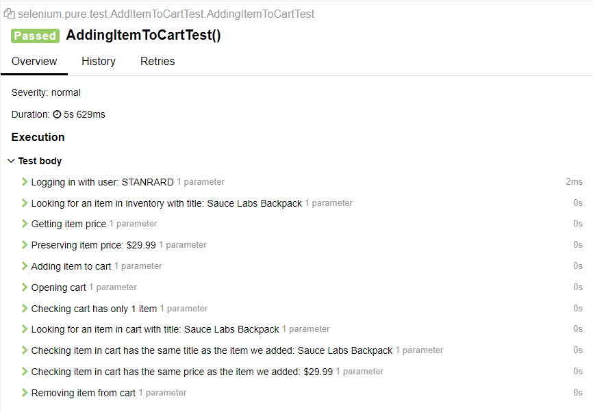

# selenium-pure
A simple UI Automation project built to demonstrate the use of pure Selenium and JUnit5

- ## Build With 🛠
  - Java
  - Maven
  - JUnit 5
  - Selenium
  - Allure Report
  - Page Object
  - Docker/Selenoid
  - Jenkins

- ## How to run RemoteWebdriver (docker)
  Inside the newly cloned project folder run the following commands:

  Pull chrome image specified in browsers.json
  ```bash
  $ docker pull selenoid/vnc_chrome:124.0
  ```

  Create network for jenkins and selenoid containers
  ```bash
  $ docker network create selenoid
  ```
  Run compose
  ```bash
  $ docker-compose up
  ```
  Specify global property 'env' as 'selenoid' to your build
  ```bash
  $ mvn -Denv=selenoid clean verify
  ```

- ## Report steps demo

 